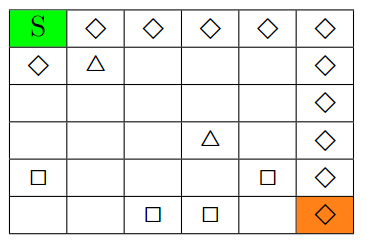
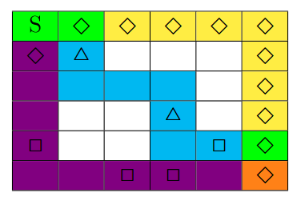
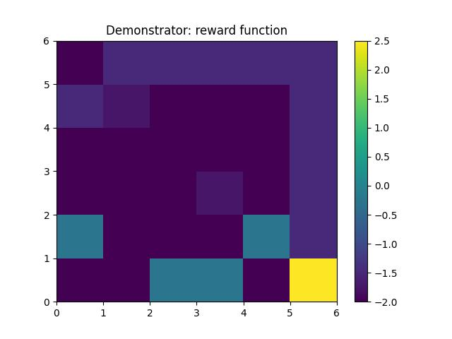

# Maximum Causal Entropy IRL

In this project, an extension of the classic Maximum Causal Entropy Inverse Reinforcement Learning algorithm was implemented within the process of a Bachelor thesis. The theoretical basis is given by Ziebart et. al. [^1]. The code for the original version of the algorithm was provided by one of the authors of [^2] in which this code was developed. This basis was modified to fit the specific experiment and also include the new approach of this work.

Within this approach we extend the classic idea of feature expectation matching to feature variance matching as there can be multiple policies that match the feature expectation of the demonstrator that might not be equally good. The variance should be another measure to model the behavior of the demonstrator even more closely. This idea can also be generalized to higher order moments.

## Problem \& Environment

For our experiment, we use a grid world scenario. The agent starts in a specified starting state on the grid and must move towards a specified end state in the minimal number of steps while simultaneously picking up as many items, placed around the grid, as possible. These items have different values, making some more important to collect than others.

Below we display the specific grid configuration for this experiment.

The values for the objects are $v(\Diamond) = 0.5$, $v(\triangle) = 0.25$, $v(\square) = 1.75$.

### Different Policies, different variances
In this setting, multiple policies can achieve the same feature expectations but have different feature variances. We consider a subset of possible paths depicted below.

Using $\gamma = 1$ we can see that the following policies have the same feature expectation count but different variances:

- $\pi_1$: follows deterministically the yellow path
- $\pi_2$: follows the cyan or the violet path with equal probability
- $\pi_3$: follows either of the three paths with equal probability

### Feature Mappings and Demonstrator

The feature mapping and the true reward parameters ($[2, 1]$) are defined such that the demonstrator should prefer the yellow path.

## Evaluation

To compare the performance of feature variance matching with the original feature expectation matching we compare the reward values under the true reward parameters and observe:

- Demonstrator's reward: $-2.0$
- Agent with expectation matchin : $-2.000586$
- Agent with additional variance matching: $-2.0$

Thus, the new algorithm is performing slightly better than the original one.

## References

[^1]: Brian D. Ziebart. Modeling purposeful adaptive behavior with the principle of maximum causal entropy. PhD thesis, USA, 2010. AAI3438449 [Link to the source](https://www.cs.cmu.edu/~bziebart/publications/thesis-bziebart.pdf). 

[^2]: Sebastian Tschiatschek, Ahana Ghosh, Luis Haug, Rati Devidze, Adish Singla. Learner-aware Teaching: Inverse Reinforcement Learning with Preferences and Constraints [Link to the source](https://arxiv.org/abs/1906.00429).